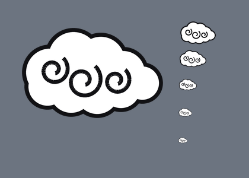
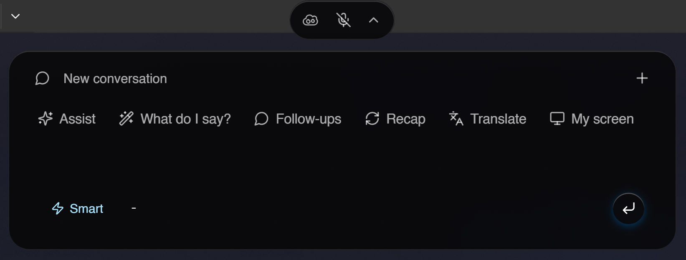
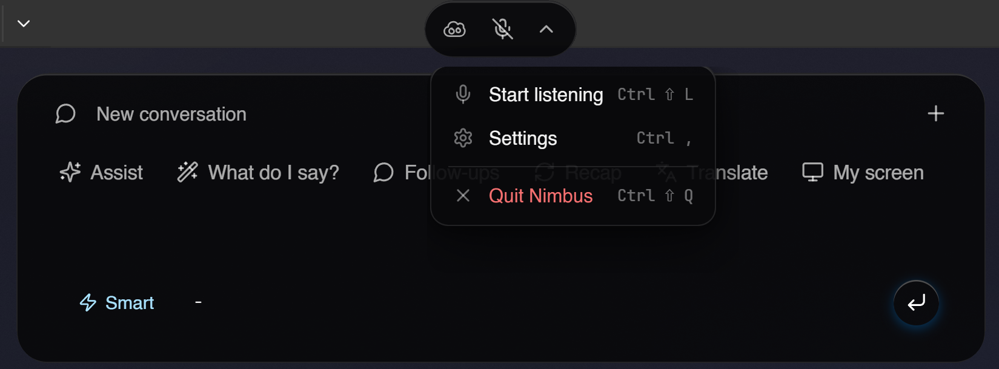
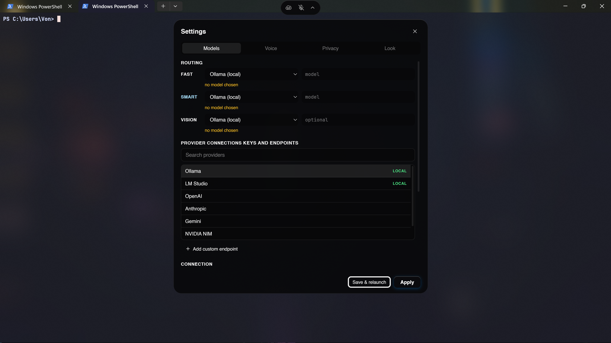
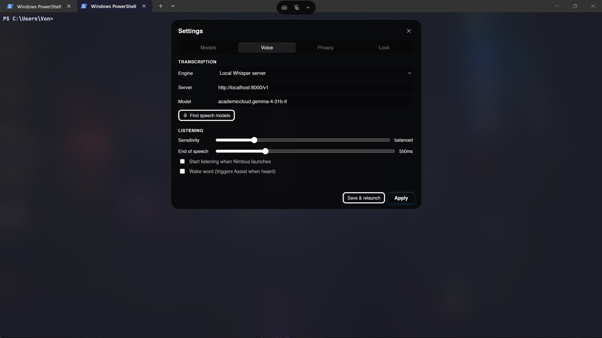
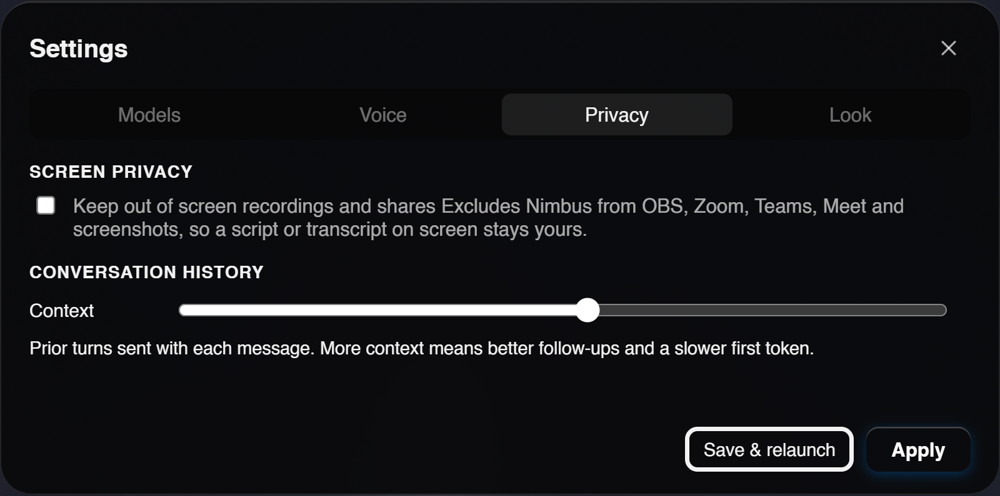
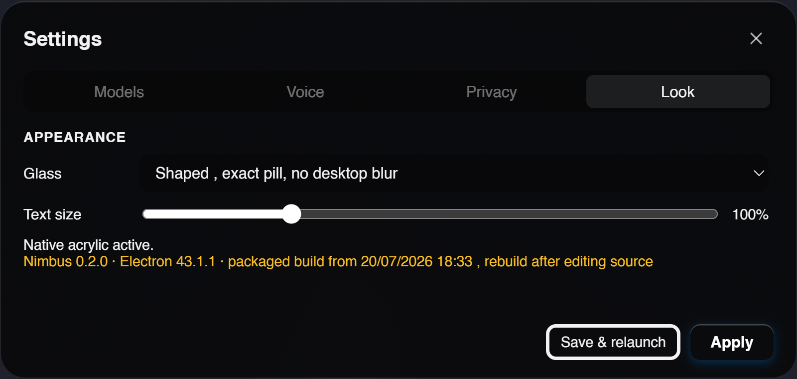
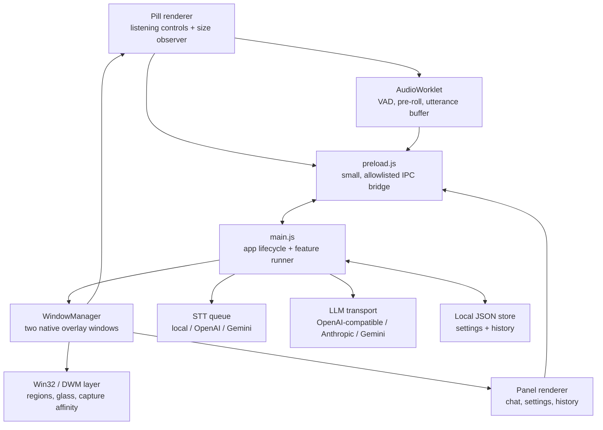

# Nimbus

<p align="center">
  
</p>

<p align="center"><strong>A Windows-native, local-first AI overlay for screen context, live conversation, and quick answers.</strong></p>

<p align="center">
  <a href="https://github.com/HarshaVardhan3002/nimbus/releases/latest"></a>
  <a href="https://github.com/HarshaVardhan3002/nimbus/releases/latest"></a>
  
  <a href="LICENSE"></a>
</p>

<p align="center">
  <a href="https://github.com/HarshaVardhan3002/nimbus/releases/latest"><strong>Download the installer</strong></a>
  · <a href="#quick-start">Quick start</a>
  · <a href="#roadmap">Roadmap</a>
</p>

> The installer is not code-signed, so Windows SmartScreen warns on first run: choose **More info** → **Run anyway**. It installs per user and does not require admin.

Nimbus is an Electron desktop assistant that stays in a compact pill until you need it. It can stream responses from local or cloud models, look at the current screen when the selected model supports vision, transcribe microphone and system audio through an independent speech-to-text backend, and retain searchable local conversation history.

It is designed around two ideas:

- **Keep the overlay out of the way.** The pill and chat panel are separate native windows, so the empty gap between them is genuinely click-through.
- **Keep the model choice yours.** Ollama and LM Studio work without API keys; OpenAI-compatible servers, OpenAI, Anthropic, Gemini, NVIDIA NIM, and custom endpoints are configurable from the app.

> [!WARNING]
> Nimbus is Windows-focused. Native glass and exact window clipping use Win32 APIs. On unsupported systems, the native layer falls back to a CSS appearance, but the app is not tested or packaged for macOS/Linux.

## Contents

- [Quick start](#quick-start)
- [Configure a model](#configure-a-model)
- [Use Nimbus](#use-nimbus)
- [Features](#features)
- [Privacy and local data](#privacy-and-local-data)
- [Build and verify](#build-and-verify)
- [Architecture](#architecture)
- [Code deep dive](#code-deep-dive)
- [Project map](#project-map)
- [Known limitations](#known-limitations)
- [Roadmap](#roadmap)

## In action

Nimbus stays compact until you open the panel, then exposes the actions and settings needed for the current task.

<p align="center">
  
  
</p>

<p align="center"><em>The chat surface and the pill menu.</em></p>

<p align="center">
  
  
</p>

<p align="center"><em>Models and Voice settings.</em></p>

<p align="center">
  
  
</p>

<p align="center"><em>Privacy and appearance settings.</em></p>

## Quick start

### Install the release

Download `Nimbus-<version>-setup.exe` from the [latest release](https://github.com/HarshaVardhan3002/nimbus/releases/latest) and run it. Nothing else is required to use the app; a model endpoint is configured from inside Settings.

### Run from source

Use this when you want to modify Nimbus or run an unreleased build.

#### Prerequisites

- Windows 10 or 11
- A current [Node.js LTS](https://nodejs.org/) release and npm
- One chat model endpoint — [Ollama](https://ollama.com/) is the easiest local option

Clone, install, validate, and launch from PowerShell:

```powershell
git clone https://github.com/HarshaVardhan3002/nimbus.git
Set-Location nimbus
npm ci
npm run check
npm run dev
```

`npm run dev` launches Electron with development logging enabled. `npm start` launches the same source build without the development flag.

### First local run with Ollama

Nimbus defaults to Ollama at `http://127.0.0.1:11434/v1`. Pull the default fast and smart models, then start Ollama:

```powershell
ollama pull llama3.2
ollama pull qwen2.5:14b
ollama serve
```

Start Nimbus in a second terminal:

```powershell
Set-Location nimbus
npm run dev
```

Open the panel with <kbd>Ctrl</kbd>+<kbd>Shift</kbd>+<kbd>Space</kbd>, then open **Settings**. Nimbus should find Ollama automatically. Use **Refresh models** if you want the app to query the server's `/v1/models` endpoint and populate the model pickers.

If your Ollama server lives on another machine, update the Ollama base URL in Settings (for example, `http://192.168.1.50:11434/v1`).

## Configure a model

All model setup is available in the Settings view; no `.env` file is required.

| Provider | Setup | Default endpoint |
| --- | --- | --- |
| Ollama | Start Ollama and choose installed models. No key is required. | `http://127.0.0.1:11434/v1` |
| LM Studio | Start its local server and enter the loaded model names. No key is required. | `http://127.0.0.1:1234/v1` |
| OpenAI | Enter an API key and model names. | OpenAI API |
| Anthropic | Enter an API key and model names. | Anthropic API |
| Gemini | Enter a Google API key and model names. | Gemini API |
| NVIDIA NIM | Enter an NVIDIA API key and model names. | `https://integrate.api.nvidia.com/v1` |
| Custom | Add an OpenAI-compatible endpoint and, if it needs one, a key. | Your endpoint |

Nimbus has independent **Fast**, **Smart**, and optional **Vision** routes. That means a quick local model can handle routine prompts while a cloud model handles more demanding work. Whether a model can see images is detected per model — from what the server declares, or from what a request proves — so screen questions work without configuring anything. A screen request is redirected to the Vision route only when the active chat model is known to be text-only.

Settings show what is needed to get running. **Show advanced settings**, at the bottom of the settings screen, reveals the rest on every tab at once: capability overrides, the Vision route, VAD tuning, context depth, the reply ceiling, and build diagnostics.

**Test connection** under Models answers the only question that matters after editing an endpoint: will this provider actually work? It checks that the server is reachable, that the key is accepted, that the model name exists on that server, and that a real generation streams back — then reports the reply, total latency, and time to first token. A provider that connects but returns nothing usable (for example a reasoning model that spends the whole token budget thinking) is reported as a warning with the specific cause, not as a success.

### Speech-to-text

Speech transcription is deliberately separate from chat-model configuration, and out of the box it needs no setup at all: Nimbus runs Whisper itself, locally.

Nothing is bundled. The installer checks the machine — RAM, graphics vendor, video memory, integrated versus discrete — and on first launch Nimbus downloads the transcription build that matches it along with a model sized to the memory available:

| Hardware | Build | Backend |
| --- | --- | --- |
| NVIDIA GPU | CUDA | whisper.cpp cuBLAS release |
| Discrete AMD GPU | ROCm | HIP backend, falls back to Vulkan |
| AMD or Intel integrated graphics | Vulkan | vendor-neutral GPU compute |
| Older machines, or under 8 GB of RAM | CPU | OpenBLAS |

Models follow the same rule: `large-v3-turbo` on a discrete card, its q5 quantisation on integrated graphics and on CPU, and progressively smaller weights on machines with little memory. Everything is cached under the app's data directory, so this is a first-run cost only.

Settings › Voice › **Local engine** shows what was detected and what is actually running — including whether the GPU backend genuinely bound to a device, which is not the same question as which build was installed. Any build and any model can be selected by hand; the automatic choice is a starting point, not a lock.

Turn **Let Nimbus run Whisper for me** off to keep using your own server instead. Both wire formats are spoken, so faster-whisper-server, Speaches, LM Studio and whisper.cpp's own server all work:

```text
POST http://127.0.0.1:8000/v1/audio/transcriptions
POST http://127.0.0.1:8081/inference
```

Alternatively choose OpenAI Whisper or Gemini in Settings after configuring the respective API key. Set transcription to **Off** if you only want typed and screen-based interactions.

### Choose what Nimbus hears

Settings › Voice › **Audio sources** controls the two capture channels independently. They are not symmetric, because they are not used for the same thing.

| Setting | Default | Effect |
| --- | --- | --- |
| System audio | On | Whatever is playing on this PC — a video, a call, a stream — is captured through Windows loopback and transcribed. No virtual audio cable needed. Turn it off to stop system capture entirely. |
| Microphone › **Push to talk** | Default | The microphone device is opened but stays muted. Audio only reaches transcription while you hold the talk key or hold the pill's talk button. |
| Microphone › Always on | — | The microphone is transcribed for as long as Nimbus is listening. This was the old behaviour. |
| Microphone › Off | — | `getUserMedia` is never called. No microphone device is opened at all. |

The default is push to talk so that the common case — "transcribe or translate what I am watching" — captures the video and not the room you are watching it in. Play a YouTube video, press <kbd>Ctrl</kbd>+<kbd>Shift</kbd>+<kbd>L</kbd>, and the transcript fills from the audio; ask a question about it by typing, or hold <kbd>Ctrl</kbd>+<kbd>Alt</kbd>+<kbd>Space</kbd> and say it. Set the target language in Settings › Voice › Transcription and the panel's **Translate** action turns the captured audio into it.

The talk chord is rebindable in the same section: click the field and press the combination you want, including a bare modifier such as right <kbd>Alt</kbd>. Hold-to-talk needs the native layer for key-up detection; without it the chord falls back to press-to-open / press-again-to-close, and the settings screen states which one is active rather than mislabelling it.

While the microphone is open the pill's talk button and its waveform turn amber, distinct from the green that means "listening". Amber means the model is hearing you.

## Use Nimbus

| Shortcut | Action |
| --- | --- |
| <kbd>Ctrl</kbd>+<kbd>Enter</kbd> | Ask Nimbus to assist with the current screen and recent transcript |
| <kbd>Ctrl</kbd>+<kbd>H</kbd> | Solve the coding problem on screen |
| <kbd>Ctrl</kbd>+<kbd>Shift</kbd>+<kbd>Space</kbd> | Open or close the chat panel |
| <kbd>Ctrl</kbd>+<kbd>Shift</kbd>+<kbd>L</kbd> | Request listening mode |
| <kbd>Ctrl</kbd>+<kbd>Alt</kbd>+<kbd>Space</kbd> | **Hold** to open the microphone (push to talk) |
| <kbd>Ctrl</kbd>+<kbd>Alt</kbd>+<kbd>Shift</kbd>+<kbd>Q</kbd> | Quit Nimbus |

The panel also provides actions for an on-screen answer, live-conversation reply suggestions, follow-up questions, recaps, and translation. Typed questions and explicit screen questions preserve conversation context; one-shot actions intentionally operate on the current screen or transcript instead of old chat history.

A typed question does not capture the screen. Sending the display to a provider is a deliberate act with three explicit entry points: the panel's screen action, <kbd>Ctrl</kbd>+<kbd>Enter</kbd> (assist) and <kbd>Ctrl</kbd>+<kbd>H</kbd> (solve).

## Features

- **Two-window overlay:** pill and panel are separate native windows. When the panel is hidden, it is removed from hit testing rather than merely hidden in HTML.
- **Screen-aware answers:** capture the primary display, resize to a bounded image, and send it only to a vision-capable route.
- **Streaming responses:** tokens are forwarded to the panel as they arrive; an active request can be aborted with the stop button or <kbd>Esc</kbd>.
- **Visible reasoning:** models that stream a separate reasoning channel show a live "Thinking…" block that collapses into "Thought for *n*s" once the answer starts, so a slow reasoning model does not look like a hung one.
- **Reply-length ceiling:** a per-answer token cap in Settings › Privacy, so a verbose or reasoning-heavy model cannot run away with the budget.
- **Independent provider routing:** local and cloud endpoints can coexist, with separate Fast, Smart, and Vision assignments.
- **Audio pipeline:** microphone and Windows loopback audio are segmented in an AudioWorklet using adaptive energy VAD, pre-roll, and a silence hangover before transcription.
- **Push-to-talk microphone:** system audio is the default listening source; the microphone opens only while a rebindable chord or the pill's talk button is held. The gate is applied inside the audio worklet, so muted frames are discarded on the audio thread rather than buffered and filtered later, and the main process enforces the same rule again at the transcription intake. The microphone can also be set to always-on or switched off so the device is never opened.
- **Conversation history:** sessions and a searchable index are stored locally, with a configurable number of earlier turns supplied as model context.
- **Model warming:** local active models can receive a minimal keep-warm request to reduce cold-start latency.
- **Capture privacy control:** an opt-in Windows display-affinity mode asks the compositor to exclude Nimbus from supported screen captures and reports whether the OS confirmed it for both windows.
- **Native visual layer with fallback:** Win32/DWM glass is applied when possible; the UI stays usable with a CSS fallback if it is unavailable.

## Privacy and local data

Nimbus does not require a cloud account to run with local models. However, privacy depends on the providers and features you enable:

- API keys and provider configuration are stored in Nimbus's Electron `userData` directory in `nimbus-data.json`. They are **local but not encrypted**; protect the Windows account that owns them.
- Conversation history is stored locally in a SQLite database, `nimbus.db`, in the same `userData` directory. It holds every message you have sent and received, in plain text, and is **not encrypted**. Delete conversations individually or all at once from the in-app history view. Earlier versions kept this history as JSON under `userData/history`; that folder is imported once on first launch and then renamed to `history.imported`, so delete it too if you want the old copy gone.
- A screen image is sent only when a feature requests it and the chosen route is marked vision-capable. With a cloud vision provider, that image leaves the machine.
- Audio is sent to the selected transcription provider. A local OpenAI-compatible Whisper server keeps it on the machine; a remote STT provider does not.
- The optional capture-privacy setting relies on Windows' display-affinity support. It cannot prevent cameras, capture cards, kernel-level capture software, or every possible recording path. Verify that the overlay still draws correctly after enabling it.

Never commit a populated user-data file, API key, or model download. The repository ignores dependencies, build output, logs, local ONNX models, captured WAV files, and font source archives.

## Build and verify

```powershell
# Static/integrity checks: JS parsing, IPC parity, asset references,
# package configuration, provider/store coherence, and geometry invariants.
npm run check

# Create an unpacked Windows app for local testing.
npm run pack

# Build the NSIS installer in dist/.
npm run dist
```

The packaging configuration unpacks native modules and model files that cannot run from Electron's ASAR archive. Run the unpacked build after `npm run pack` when validating packaging-specific behavior such as native glass or speech dependencies.

## Architecture



The main process owns privileged capabilities: windows, global shortcuts, screenshot capture, settings, network requests to model providers, and the serial STT queue. Renderers are intentionally unprivileged: `contextIsolation` is enabled, Node integration is disabled, and [`preload.js`](preload.js) exposes only explicit IPC methods/events.

### Why two windows?

The pill and panel cannot safely be one transparent `700×600` Electron window. A single window would still receive clicks in the visually empty space between the two UI surfaces, even when the panel is `display: none`. Nimbus instead creates a pill window and a panel window. When the panel closes it calls the native window hide path, so there is no Electron window in the gap at all.

Each renderer reports only the axis it owns: the pill reports width and the panel reports height. [`src/windows/manager.js`](src/windows/manager.js) then positions and resizes windows in the main process with an interruptible spring. A GDI rounded region makes the native hit-test region match the rounded visual shape.

## Code deep dive

### 1. Startup and process boundaries

[`main.js`](main.js) is the composition root. It obtains the single-instance lock, configures media permissions and Windows loopback capture, creates the `WindowManager`, registers global shortcuts, and installs IPC handlers.

```js
// main.js — renderer requests cross a narrow boundary
ipcMain.handle('settings:get', () => store.getSettings());
ipcMain.handle('providers:list', () => providers.list(store.getSettings()));
ipcMain.on('ask', (_event, payload) => runFeature(payload?.mode, payload?.text));
ipcMain.on('audio:utterance', (_event, meta, buffer) => {
  if (!state.listening || !buffer) return;
  const channel = meta?.channel || 'you';
  // Second gate. The worklet already dropped muted mic frames; this is the
  // backstop, with a grace window because the VAD emits an utterance when the
  // speaker stops, which is often just after the talk key is released.
  if (channel === 'you' && !state.micOpen
      && Date.now() - state.micClosedAt > MIC_RELEASE_GRACE_MS) return;
  enqueueUtterance(channel, Buffer.from(buffer));
});
```

The renderer cannot invoke arbitrary Node APIs. [`preload.js`](preload.js) maps a finite set of operations onto `ipcRenderer.invoke`/`send` and verifies inbound event names against an allowlist. The validation script checks that every renderer-originated channel has a corresponding main-process handler.

### 2. Prompt execution and streaming

`runFeature(mode, userText)` in [`main.js`](main.js) turns a UI action into a model request:

1. It loads current settings and resolves the selected Fast or Smart route.
2. For screen-aware modes, it redirects to the optional Vision route if the current model is text-only.
3. It captures the screen only when the final route can accept images.
4. It builds a mode-specific system prompt and user content from [`src/prompts.js`](src/prompts.js).
5. It adds recent context only for conversational modes.
6. It streams tokens to the renderer as `llm:token` events, persists the completed exchange, and clears busy state in `finally`.

The core route resolution is small but important:

```js
// src/providers.js
function resolveTier(settings, tier) {
  const route = routeFor(settings, tier);
  const providerId = route.provider || settings.provider;
  const base = resolve(settings, providerId);
  if (!base) return null;
  return { ...base, tier: route.tier, model: route.model || base.model, routed: !!route.provider };
}
```

This is why changing the Smart route does not alter the Fast route. A local endpoint can be keyless; the provider registry separates `needsKey` from model readiness so Ollama and LM Studio are valid configurations without invented credentials.

[`src/llm.js`](src/llm.js) chooses the provider transport, normalizes streaming callbacks, and has a single recovery path for misclassified vision models: if an image request is rejected in a way that looks vision-related, it retries once without the image and tells the UI why.

### 3. Screen capture and vision safety

[`src/screen.js`](src/screen.js) captures the relevant display in the main process and bounds the image edge before it reaches a provider. Capability is tracked per model, not per provider: Nimbus asks the server what the selected model accepts, attaches the screenshot unless that model is known to be text-only, and if the request is rejected for the image, the retry mechanism in `src/llm.js` answers from text instead of failing outright and records `vision: false` for that one model.

This is intentional behavior, not a cosmetic setting: the app would rather give a text-grounded response than silently ask a model to inspect an image it cannot process.

### 4. Audio to transcript

Audio capture starts in the renderer because browser media APIs and `AudioWorklet` live there. [`renderer/vad-processor.js`](renderer/vad-processor.js) works in short audio frames and maintains:

- an adaptive noise floor;
- separate enter/exit thresholds (hysteresis);
- a 300 ms pre-roll ring buffer, preserving the start of speech; and
- a 550 ms default silence hangover, marking the end of an utterance.

When an utterance ends, its PCM buffer is transferred to main through `audio:utterance`. The main process serializes requests deliberately:

```js
// main.js
function enqueueUtterance(channel, pcm) {
  sttQueue = sttQueue
    .then(() => transcribeOne(channel, pcm))
    .catch((error) => console.error('[nimbus] stt queue error:', error?.message));
}
```

Many local Whisper servers are single-slot. Serializing preserves transcript order and avoids sending several timeouts to a server that would simply queue them internally.

[`src/stt.js`](src/stt.js) converts 16 kHz PCM to WAV via [`src/wav.js`](src/wav.js) and tries the selected provider, then eligible fallback providers. The local path is regular `fetch` + `FormData` against `/audio/transcriptions`; it does not require a Python bridge or a special Whisper binding.

The wake word is transcript-based, not an always-on neural keyword spotter. It is portable across STT backends, but necessarily fires after the utterance has been transcribed.

### 5. Native windows, glass, and movement

[`src/windows/manager.js`](src/windows/manager.js) owns two `BrowserWindow` instances and the desired geometry for both. It uses a single explicit `setBounds` route rather than a `getBounds()` → modify → `setBounds()` loop. That avoids accumulated DIP/physical-pixel rounding error on high-DPI displays.

[`src/spring.js`](src/spring.js) integrates panel and pill bounds in the main process, where CSS cannot animate a native window. The spring carries velocity across a target change, so an already-opening panel can resize smoothly as content changes.

[`src/native/win32.js`](src/native/win32.js) uses `koffi` to call Win32 APIs for DWM accent policies, rounded GDI regions, and optional display affinity. Every native operation is guarded so a missing library or unsupported Windows build degrades to a no-op rather than crashing the app.

There is a real Windows trade-off: DWM acrylic paints over the full rectangular window and does not respect a custom rounded region. The default **shaped** mode favors the exact pill silhouette; **acrylic** and **blur** modes choose real desktop blur with Windows-managed rounded corners.

### 6. Local persistence and history

[`src/store.js`](src/store.js) deep-merges versioned defaults with `nimbus-data.json` in Electron's user-data directory. It debounces writes and uses a temporary-file rename for atomic updates. Settings changes are broadcast back to both renderers after main has accepted them.

[`src/history.js`](src/history.js) stores one JSON file per conversation plus a compact index. That keeps the history browser fast and allows a single corrupt or deleted session to affect only that session. The default model context is the most recent 12 user/assistant turns; changing it trades follow-up quality against prompt size and latency.

### 7. Local-model warming

[`src/warmth.js`](src/warmth.js) pings the active local model with a tiny request on a 12-second cadence. It intentionally skips cloud providers, where a keep-warm request would consume paid API usage for little benefit. It also detects a likely fast/smart model-switch penalty when both routes share a single-slot local server.

## Project map

```text
main.js                     Main-process lifecycle, IPC, features, shortcuts
preload.js                  Safe renderer-to-main bridge
renderer/pill/              Compact overlay UI and listening controls
renderer/panel/             Chat, Settings, history, and streamed response UI
renderer/vad-processor.js   AudioWorklet speech segmentation
src/providers.js            Provider registry, route resolution, model discovery
src/llm.js                  Provider transports and streamed LLM requests
src/stt.js                  Independent STT factory and fallbacks
src/screen.js               Main-process screenshot capture
src/store.js                Versioned local settings persistence
src/pushtotalk.js           Hold-to-talk chord polling, with a latch fallback
src/history.js              Local conversation-session persistence and search
src/windows/manager.js      Two-window topology, sizing, dragging, clipping
src/native/win32.js         Win32/DWM FFI with safe fallbacks
src/spring.js               Main-process native-window spring animation
src/warmth.js               Local-model keep-warm logic
scripts/check.js            Repository integrity and regression checks
ARCHITECTURE.md             Detailed engineering notes and measured behavior
```

## Known limitations

- The app is Windows-first; macOS and Linux are not supported release targets.
- Local STT requires a separately running compatible server. Nimbus does not download or host a Whisper model itself.
- The VAD is energy-based, not a neural voice activity detector. It can still react to loud non-speech audio.
- Wake-word matching happens after transcription, so it is not an instant keyword spotter. It also only matches the microphone channel, so with the microphone on push to talk it fires only while the talk key is held.
- Hold-to-talk needs the Win32 layer for key-up detection. Without it the chord becomes a press/press-again latch; `native:status` reports which one is active.
- The talk chord is observed, not claimed, so binding a combination another application already uses will trigger that application as well.
- Push-to-talk holds the microphone device open for the whole listening session so the first word is not clipped, which means the Windows microphone-in-use indicator stays lit even while the mic is muted. Set the microphone to **Off** if the device must not be opened at all.
- Screen capture depends on the selected route being truly vision-capable. Nimbus has safeguards and a text-only retry, but provider capability metadata can be incomplete.
- Device control and agentic actions are not implemented; Nimbus can read screen/audio context but does not operate other applications.
- Speaker-verification primitives exist in `src/audio/speaker.js`, but identity-based routing is not currently wired into the live transcript pipeline.

## Roadmap

Planned directions, not commitments or dated releases. Ordering may change.

- **macOS support.** The native layer (window clipping, DWM acrylic, capture exclusion, display affinity) is Win32-specific today. macOS needs an equivalent path built on `NSWindow` shaping, vibrancy, and the platform's own capture-exclusion behavior, plus a signed and notarized build.
- **UI/UX refinements.** Continued work on the panel: layout density, keyboard-only operation, clearer streaming and error states, and settings that explain the consequence of each option rather than only naming it.
- **Seamless STT and TTS.** Lower-latency speech in, and spoken answers out. The goal is a conversation that does not wait on a full utterance boundary: streaming partial transcripts, a neural VAD in place of the current energy VAD, true always-on keyword spotting, and an optional local TTS voice so answers can be heard instead of read.
- **Harness connection.** A supported way to attach Nimbus to an external agent or automation harness, so the overlay can act as the human-facing surface for a longer-running process instead of only answering single prompts.
- **Rust porting.** Move latency- and safety-sensitive parts out of Node: audio segmentation, native window control, and screen capture are the first candidates. The aim is lower overhead and fewer native bindings, exposed to the existing UI rather than replacing it wholesale.
- **Privacy and quality-of-life enhancements.** Encrypted local credential storage instead of plaintext in `nimbus-data.json`, per-provider data-egress indicators, redaction before a screenshot leaves the machine, history retention rules, and per-session provider overrides.

## Contributing

Before opening a change, run:

```powershell
npm run check
```

Keep renderer code behind the existing preload bridge, avoid adding broad IPC channels, and preserve the two-window geometry invariant. The check script is intentionally strict about IPC parity, assets, provider/store coherence, and the single native-window `setBounds` path.

## License

Nimbus is licensed under the [GNU GPL v3.0](LICENSE).
